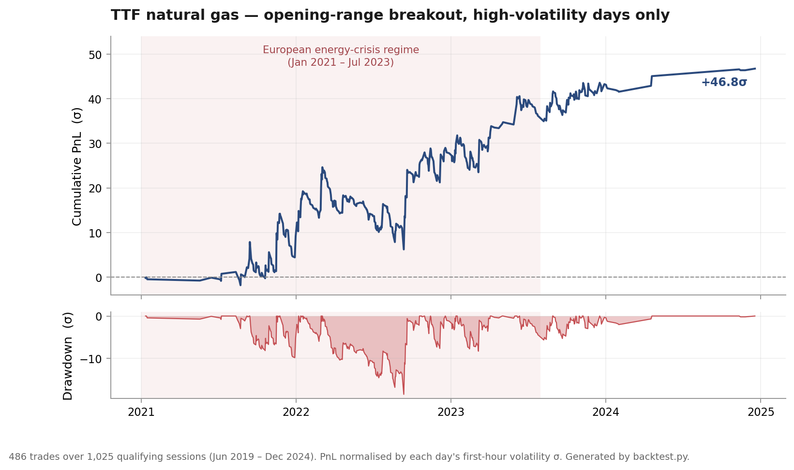

# TTF Natural Gas — Intraday Opening-Range Breakout

Research code for an intraday trend-following breakout strategy on **Dutch TTF natural gas futures**, built from 1-minute OHLCV data spanning **June 2019 – December 2024**.

The repository contains the full research chain — data audit, exploratory analysis, level selection, conditioning, exit-rule validation, and backtest — not just the final strategy. Every design choice below is supported by a diagnostic in `analysis/`, and the accompanying write-up is in **[`report.pdf`](report.pdf)**.

---

## Headline result



| Metric | Value |
| --- | --- |
| Sample | 1,025 qualifying sessions → 486 trades (max one per day) |
| Cumulative PnL | **+46.8 σ** |
| Sharpe (daily, annualised) | **1.16** |
| Max drawdown | **−18.4 σ** |
| Win rate | 27.2 % |
| Trade PnL — median / p90 / max | −0.21 σ / 1.70 σ / 8.52 σ |
| PnL — long / short | 25.2 σ / 21.6 σ |
| PnL — crisis / non-crisis | 36.2 σ / 10.6 σ |
| Exits — structure-fail / hard stop / end-of-day | 261 / 67 / 158 |
| Hold time — median / p75 | 23 min / 430 min |

All PnL, drawdown and excursion figures are expressed in **σ units**: each day's outcomes are divided by that day's first-hour realised volatility, measured in price terms. This makes a €0.30 move in a quiet 2019 session and a €3.00 move in a 2022 crisis session directly comparable, and it is what lets the strategy be evaluated over a period in which the underlying's volatility moved by an order of magnitude.

> Figures are produced by `backtest.py` on the current code. `report.pdf` (24 Dec 2025) quotes 45.7 σ / 1.15 / −17.7 σ; the small delta comes from post-report refinements to the hard-stop trigger (evaluated on closes rather than intrabar extremes) and to the data loader. The shape of the result is unchanged.

---

## The hypothesis

Intraday volatility and volume in TTF are heavily **front-loaded** — the first hour of the session carries a disproportionate share of daily variance — and the day's total range is typically **2.2–2.8×** the width of the opening range. That combination is the economic precondition for a breakout strategy: an early range that is informative about the day's eventual boundaries, and enough remaining session for a directional move to develop.

The exploratory work (§3 of the report) also establishes the shape of the payoff that any viable rule must accommodate. Volatility, volume and expansion ratios are all **right-skewed** — mean above median in every intraday bucket. Most days do not expand meaningfully beyond the opening range; a small minority expand enormously. A strategy built on this must therefore tolerate frequent small losses, avoid capping its winners, and control the left tail explicitly rather than by trading less often.

---

## Method

### 1. Data audit and gap-aware volatility

The raw series is materially incomplete — **33 % of expected session bars are missing**, concentrated in the first trading hour and in the pre-crisis period (`analysis/missingness_heatmap.py`). Rather than interpolate or forward-fill, which would fabricate the low-volatility paths the strategy is most sensitive to, the pipeline:

- reindexes to a complete 1-minute grid and keeps missing bars as explicitly missing;
- drops any day with fewer than **20 %** of expected first-hour bars or **20 %** of expected session bars;
- estimates volatility only from **observed** returns, normalised by elapsed time and excluding any return spanning more than 10 minutes or a session boundary:

$$\sigma^2_{\text{per min}} = \frac{\sum_i r_i^2}{\sum_i \Delta t_i}, \qquad r_i = \log\frac{P_i}{P_{i-1}}, \qquad T = \sum_i \Delta t_i$$

$$\sigma_{\text{px}} = P_{\text{VWAP}} \left( e^{\sigma_{\text{per min}}\sqrt{T}} - 1 \right)$$

Realised variance is accumulated only over the minutes actually observed, then converted from log space into a **price-denominated** σ anchored at the first-hour VWAP — so "1.25 σ" is a concrete price distance on every day, and is the reference unit for everything downstream.

### 2. Level selection by path asymmetry — *first order*

Candidate levels (opening-range high/low, first-hour VWAP, VWAP ± kσ, VWAP ± r·ATR₁₄) are ranked not by profitability but by **volatility-normalised path asymmetry**:

$$\text{Asym} = \operatorname{med}(\text{MFE}) - \operatorname{med}(\text{MAE})$$

measured over the remainder of the session after the level is crossed. Positive asymmetry means that, conditional on a crossing, the subsequent path shows directional persistence rather than mean reversion — a property of the *level*, independent of any exit rule.

Levels are retained only if they clear three filters fixed in advance: **n ≥ 600**, **sign-stable asymmetry across crisis and non-crisis samples**, and **median asymmetry ≥ 0.15 in both regimes**.

The opening-range low clears all three (n = 640, asym 0.188 / 0.248), as do first-hour VWAP and VWAP ± 0.5 σ. The ATR-derived levels almost all fail on sample size — `ATR + 1R` has the highest raw asymmetry in the entire table (0.725 / 0.595) on just 81 observations, which is exactly the kind of result the n-floor exists to discard. Notably, the opening-range **high** also fails unconditionally: 0.274 in crisis but only 0.057 outside it.

### 3. Confluence and conditioning — *second and third order*

- **Confluence** (requiring two levels to be crossed) was tested and **rejected**: it reduces sample size and, for `OR_HIGH ∧ VWAP`, flips asymmetry negative out of crisis (−0.22).
- **Volatility conditioning** was tested and **retained**. Splitting on first-hour σ at the median materially improves both asymmetry and tail behaviour:

  | Level | Dir | Vol | n | MFE | MAE | q90 MAE | Asym (crisis) | Asym (non-crisis) |
  | --- | --- | --- | ---: | ---: | ---: | ---: | ---: | ---: |
  | OR LOW | down | Low | 323 | 1.211 | 1.120 | 3.603 | −0.121 | 0.213 |
  | OR LOW | down | **High** | 317 | 1.053 | 0.783 | **2.895** | **0.275** | **0.555** |
  | OR HIGH | up | Low | 367 | 1.233 | 1.160 | 3.658 | 0.269 | −0.014 |
  | OR HIGH | up | **High** | 330 | 1.287 | 0.918 | **2.897** | **0.275** | **0.546** |

  This is what rescues the opening-range high. Unconditionally it fails the asymmetry floor; restricted to high-σ days it reaches 0.275 / 0.546 and becomes sign-stable, while the *low*-σ bucket is where the sign flips (−0.014 out of crisis). The same pattern holds in mirror image for the opening-range low. Across both, conditioning cuts the 90th-percentile adverse excursion by roughly 0.75 σ — the tail control is as valuable as the asymmetry gain.

- **Third-order conditioning** (opening-range compression, distance at cross, time of cross, first-hour drift alignment, volume confirmation) was tested and **rejected**. The effects are directionally intuitive but do not beat the second-order baseline, and each split roughly halves the sample. Documented as a negative result in Table 7 of the report.

### 4. Strategy definition

The traded strategy uses the opening-range high and low. Of the surviving levels these are the ones for which a *structure* exists to fail — "price has re-entered the range" is a well-defined, economically meaningful event in a way that "price has crossed back over VWAP" is not — which is what makes the early failure rule below possible.

| Component | Rule | Rationale |
| --- | --- | --- |
| Universe filter | First-hour σ in the upper half of the sample | Only conditioning that survived §3 |
| Signal | First true close-through of the 07:00–07:59 range high (long) or low (short), from 08:00 onward | First cross only; one trade per day |
| Entry | Open of the **next** bar | No same-bar fill |
| Take-profit | **None** — hold to end of day | Time-to-MFE is widely dispersed; capping profit destroys the right tail that carries the edge |
| Hard stop | **1.25 σ** beyond entry | Above typical noise (median MAE ≈ 0.8–0.9 σ), below extreme excursions (q90 ≈ 2.9 σ) |
| Structure-failure stop | Exit if price re-enters the range by **0.1 σ within 30 minutes** | A genuine breakout should not immediately revert |

### 5. Exit-rule validation — *exit-invariant diagnostics*

The exits were not tuned on PnL. `analysis/stop_validation.py` evaluates them against **path** statistics measured to end-of-day, which are invariant to the exit rule being tested:

| Diagnostic | Result |
| --- | --- |
| **Barrier race** — does TP or SL come first at symmetric k σ? | Small favourable barriers are reached quickly when a breakout is genuine; false breakouts fail early. Supports a *fast* failure rule. |
| **Latent winners** — do structure-failure exits kill trades that would have won? | Some stopped trades do eventually reach favourable levels, but the majority never become large winners. |
| **Path comparison, structure-failure** | Would-fail: MFE 0.82, MAE 1.35, **asym −0.52** (n=261) · No-fail: MFE 1.43, MAE 0.56, **asym +0.88** (n=225) |
| **Path comparison, hard stop @1.25 σ** | Would-hit: MFE 0.56, MAE 2.16, **asym −1.60** (n=207) · No-hit: MFE 1.72, MAE 0.46, **asym +1.26** (n=276) |
| **Stop-distance sweep** (0.75 / 1.00 / 1.25 σ) | Tighter stops raise PnL and Sharpe but worsen drawdown. 1.25 σ retained as the tail-risk-conservative choice. |

Both rules cleanly separate low-quality from high-quality paths — they remove trades that were going to lose, not trades that were going to win.

---

## What this repository is careful about

These are the choices that keep the result from being an artefact of the fitting process:

- **No look-ahead.** Levels are built from 07:00–07:59; signals are only evaluated from 08:00; entry is the *next* bar's open. The construction window and the trading window never overlap.
- **Crossings, not touches.** `first_true_cross_time` requires a genuine transition (previous close on one side, current close on the other), so a bar that simply opens beyond a level is not counted as a breakout.
- **No fabricated data.** Missing bars are never interpolated or forward-filled; the volatility estimator is explicitly gap-aware and session-boundary-aware.
- **Pre-committed selection filters.** Levels are chosen by sample size, regime sign-stability and a minimum asymmetry floor — not by searching for the highest Sharpe.
- **Exits validated out-of-objective.** Stop rules are justified by exit-invariant MFE/MAE path statistics, not by the PnL they produce.
- **Negative results kept.** Confluence and third-order conditioning were both tested and discarded; their tables remain in the report.
- **Everything in σ units,** so no conclusion is driven by the level of gas prices in a given year.

---

## Repository layout

```
├── backtest.py                       # End-to-end strategy backtest and metrics table
├── report.pdf                        # Full write-up: method, tables, figures
├── analysis/
│   ├── missingness_heatmap.py        # Data audit: gap structure by date × minute
│   ├── intraday_volatility_and_volume.py  # Intraday σ and volume curves, by weekday and regime
│   ├── expansion_ratio.py            # Day range ÷ opening range, across 30–90 min windows
│   ├── stop_validation.py            # Barrier race, latent winners, stop sweep, path classifiers
│   └── persistence_analysis/
│       ├── first_order.py            # Level ranking by path asymmetry + regime sign stability
│       ├── second_order.py           # Volatility conditioning and confluence
│       └── third_order.py            # Range / distance / time / drift / volume conditioning
├── utils/
│   ├── constants.py                  # Session, regime and coverage parameters
│   ├── data.py                       # Loading, session filtering, per-day coverage gate
│   ├── volatility.py                 # Gap-aware σ estimator, VWAP reference price
│   ├── events.py                     # Cross detection, MFE/MAE excursions, confluence timing
│   ├── regimes.py                    # Crisis / non-crisis labelling
│   ├── summary.py                    # Grouped quantile and event summaries, sign-stability tests
│   ├── time_features.py              # Session-relative time helpers
│   └── plotting.py                   # Shared chart styling
├── data/OHLCV.csv                    # 1-minute bars (not distributed — see below)
└── docs/equity_curve.png             # Figure above, regenerated from backtest.py
```

---

## Running it

**Requirements:** Python 3.12, `pip install -r requirements.txt`.

**Data.** The OHLCV file is not distributed with the repository. Place it at `data/OHLCV.csv` in the following format — semicolon-separated, comma as decimal mark, 1-minute bars:

```
Time;open;high;low;close;volume
2019-06-03 07:08:00;11;11;11;11;10
2019-06-03 07:48:00;11,225;11,225;11,225;11,225;5
```

Session hours, crisis window and coverage thresholds are configured in [`utils/constants.py`](utils/constants.py).

**Backtest:**

```bash
python backtest.py
```

**Analysis scripts** import from `utils/`, so run them as modules from the repository root:

```bash
python -m analysis.missingness_heatmap
python -m analysis.intraday_volatility_and_volume
python -m analysis.expansion_ratio
python -m analysis.stop_validation
python -m analysis.persistence_analysis.first_order
python -m analysis.persistence_analysis.second_order
python -m analysis.persistence_analysis.third_order
```

Each prints its summary tables and opens its figures. Strategy parameters (`STOP_SIGMA`, `EPS_FAIL_SIG`, `VOL_SPLIT_QUANTILE`, `SLIPPAGE_BPS`, `COMMISSION_PER_UNIT`) are module-level constants at the top of `backtest.py`.

---

## Limitations

Stated plainly, because they bound what the headline number means:

1. **The volatility gate uses a full-sample threshold.** `VOL_SPLIT_QUANTILE` is applied to the σ distribution of the entire 2019–2024 sample, so eligibility for a given day depends on information from the whole period. Because crisis-era volatility sets the level of that threshold, the gate admits **no days at all in 2019–2020** and only 13 trades in 2024; the 486 trades are distributed 93 / 202 / 178 / 13 across 2021–2024. An expanding- or rolling-window quantile is the correct fix and is the first thing to change before any further inference.
2. **The edge is concentrated in the crisis period** — 36.2 σ of 46.8 σ. The non-crisis contribution is positive but thin, and given (1) it is drawn almost entirely from late 2023 onwards.
3. **The return distribution is concentrated in a few trades.** Median trade PnL is negative (−0.21 σ); the single best trade is 8.5 σ. Performance over shorter horizons will be unstable, and the Sharpe figure should be read with that in mind.
4. **No transaction costs, slippage or liquidity constraints are modelled.** Hooks exist (`SLIPPAGE_BPS`, `COMMISSION_PER_UNIT`) but are set to zero. Given intraday turnover and stop-driven exits, realised performance would be materially lower.
5. **The hard stop is optimistic on gap-through bars.** It triggers on a close beyond the stop but fills at the stop level.
6. **Unit sizing throughout.** No position sizing or risk budgeting, so drawdowns are expressed per-unit rather than per-unit-of-risk-capital.
7. **No out-of-sample or walk-forward split.** Level selection, conditioning and exit calibration all use the full sample. The regime sign-stability test is a partial substitute, not a replacement.

The strategy should be read as a **research result, not a deployable system** — it would require walk-forward validation, cost modelling and stress testing before any capital decision.

---

## Further work

- **Re-specify the volatility gate** as an expanding-window quantile and re-run the full chain; this is the single change most likely to alter the conclusions.
- **Failure-conditioned strategies.** The strongest and most regime-stable asymmetry anywhere in the study is not the breakout itself but its failure: trades hitting the 1.25 σ hard stop show asymmetry of −1.60 with a clean separation from non-stopped trades. That suggests stop events identify a distinct, tradeable price regime rather than merely controlling risk.
- **Execution modelling** — spread, market impact and the liquidity profile of TTF around the 07:00–08:00 window.
- **Explicit risk budgeting** to convert σ-normalised PnL into a sized, drawdown-constrained allocation.

---

**Author:** Linus Weigand · Full write-up: [`report.pdf`](report.pdf)
